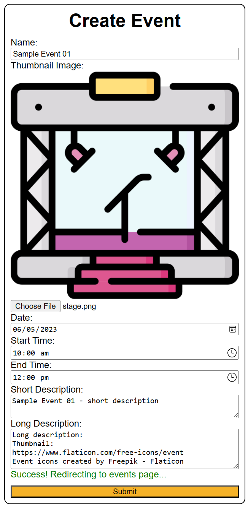
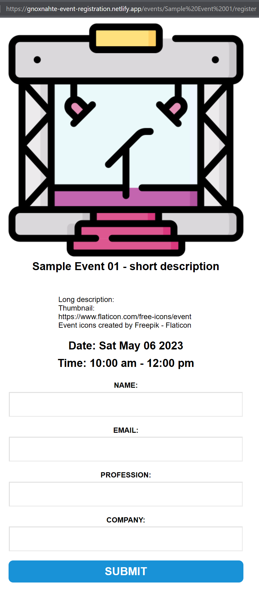
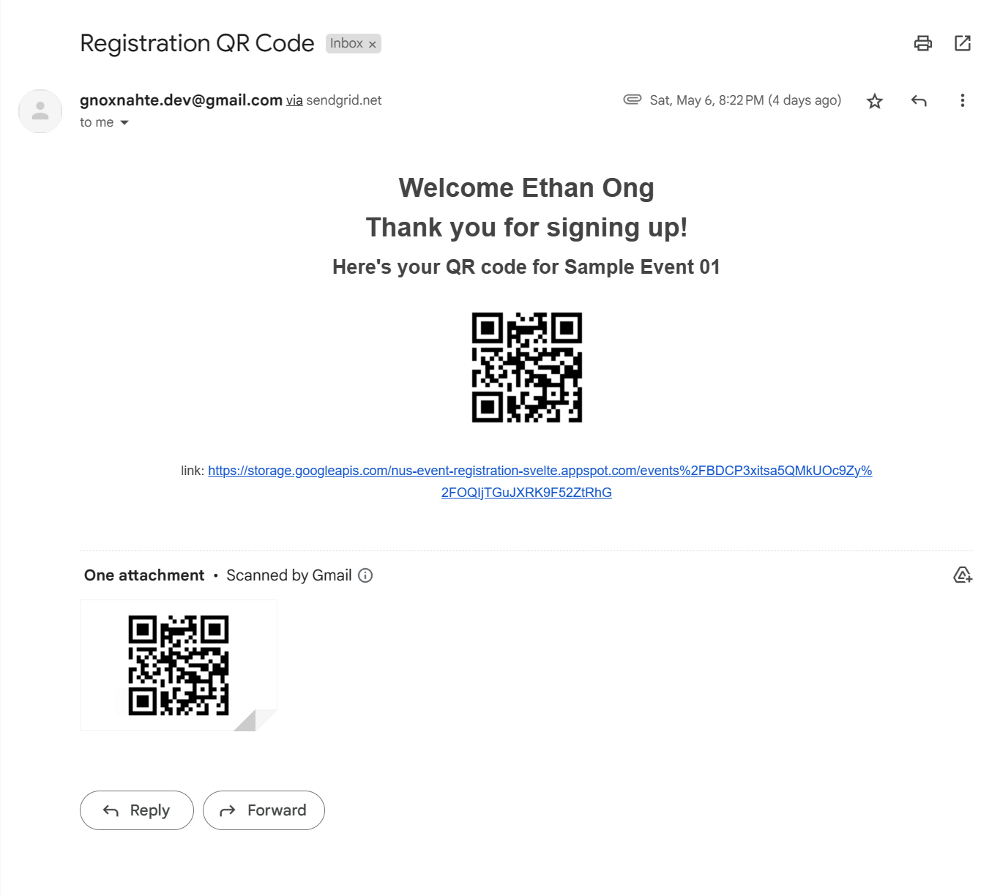
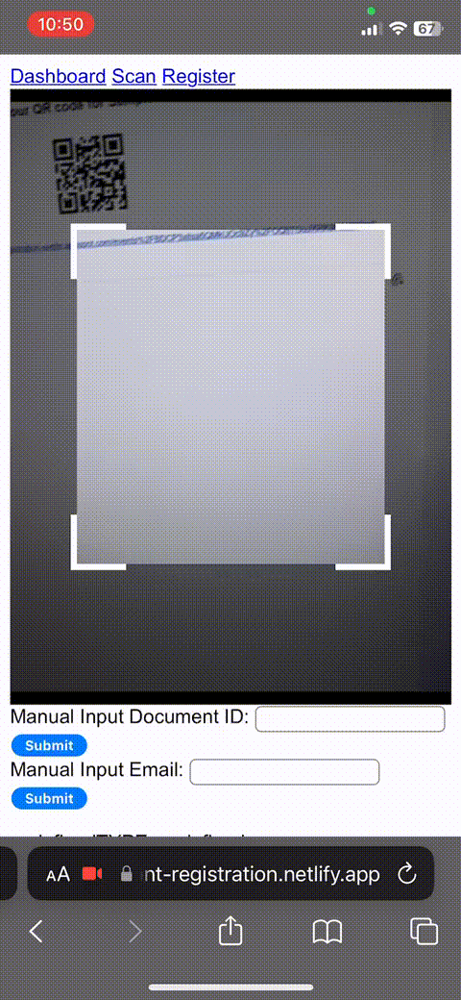
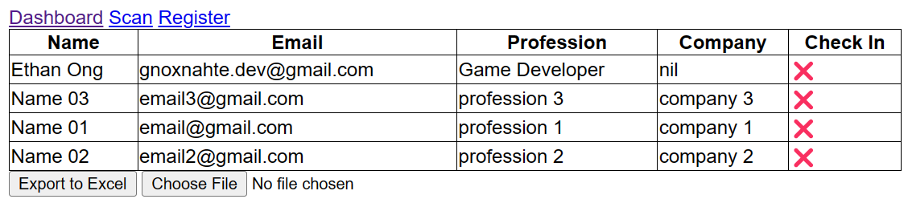
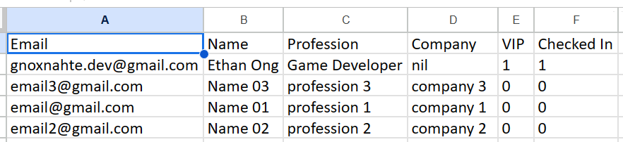
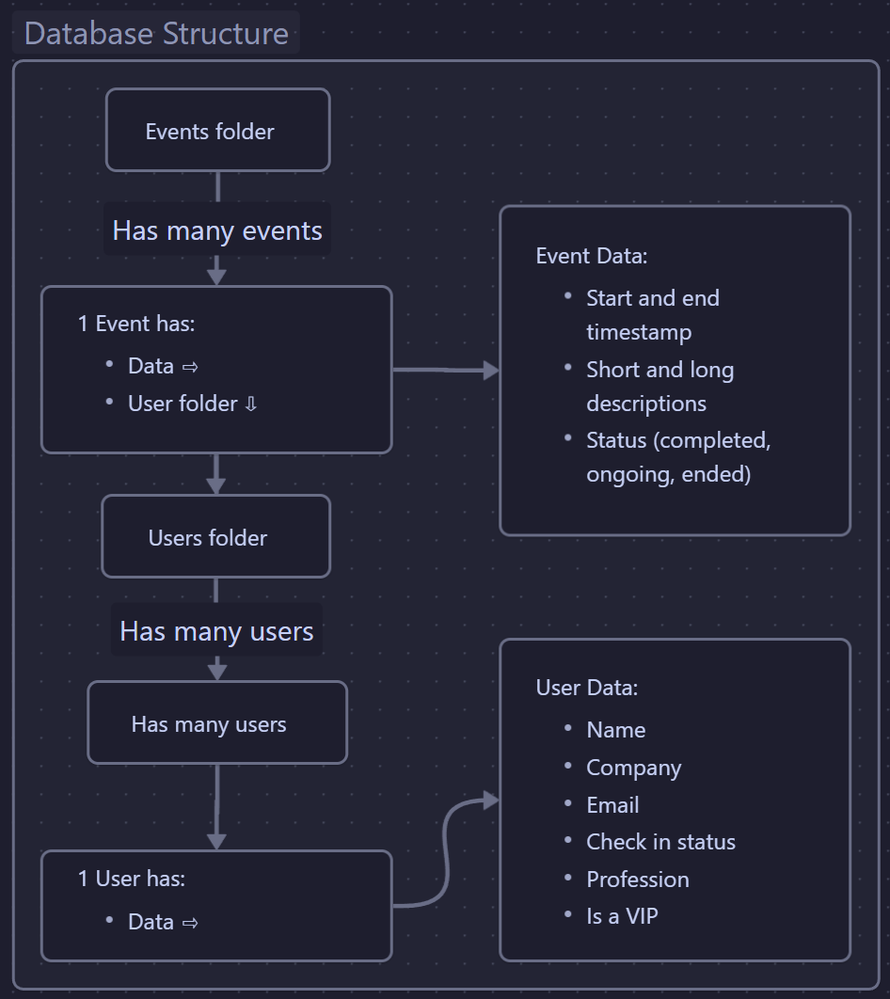

## Disclaimer
- This was a prototype so...
    - Many features are not done
    - Website is a bit slow
    - Styling (CSS) is very basic
    - and there might be some bugs.
- Was built on my free time from NS so wasn't full-time on the project

[Here's the website](https://gnoxnahte-event-registration.netlify.app), note that it has not been maintained since I dropped it (12 April 2023).

## Project Background
My father knew I was self-learning web development and asked me if I could develop an event registration website because he said that his company's event registration process was *slow and inefficient*. They were using Excel sheets and [EventBrite](https://www.eventbrite.sg/) to register and keep track of participants. 

If I was able to make a working prototype, he would help me pitch to his colleagues and boss to outsource the project development to me. So I started building it. 

## Project building process
While building, when I showed him a mini <abbr title="Minimum Viable Product">MVP</abbr>, I misunderstood the requirements and thought my father wanted users to register (using email or some authentication service). However, he wanted users to just fill up the form and submit it without any authentication, which I think is better for faster registration for users, even though its slightly less secure. This meant I had to remove tons of stuff and wasted a lot of time. Through this, I learnt to clarify project requirements clearly before developing it.

Halfway while building through it, he showed his colleagues and heard positive comments so I thought I was making good progress. When I had a working prototype with all the basic features, he showed it to his boss which was pushed further higher up the leadership ladder. In the end, they said that they can't accept it because they aren't comfortable with letting a third-party handle the database and it needed a lot of approval. 

Last I heard, they are going to build their own version of it and use my website as a reference.

So, I dropped the project. I might develop it into a full fledged [<abbr title="Software as a Service">SaaS</abbr>](<https://azure.microsoft.com/en-us/resources/cloud-computing-dictionary/what-is-saas#:~:text=Software%20as%20a%20service%20(SaaS,from%20a%20cloud%20service%20provider.>) product in the future when I'm free.

That's the end of the background, all the content below is about the features that were inside the website.

## Overview on user workflow
1. Staff creates a new event
2. Staff sends a register event link to Users
3. User register event through link
4. User receive email with QR Code
5. User attends event and shows the QR Code to Staff
6. Staff swiftly scans QR Code, authenticate and checks in users

**3** total steps for Staff and User.  
**1** step for the Staff and User on the event day! Greatly reducing registration time, which leads to reducing long queues.

## Project Scope & Features 
Like previously mentioned in [Disclaimer](#disclaimer), note that it's a prototype so it has basic styles.

### Event Creation

Create Event Page

- Supports multiple events
- Has simple validation:
    - Any required fields left blank
    - End time earlier than start time
    - Check with the database for duplicate events

### Sending users the registration form

Registration form the user would receive

Here's the link for the [sample event registration form](https://gnoxnahte-event-registration.netlify.app/events/Sample%20Event%2001/register). It should still work and send an email with a QR Code to your email address once you submit the form, as long as the [services I used](#software-used) is still working. No guarantee as I haven't been maintaining it since I've dropped the project.

After submitting the form, users would get a QR Code that the event staff are able to scan on the event day. The event staff can also add additional info like an event guide to the email.

Email With QR Code

### Authentication and check-in for users

Quick scanning of QR Code

As shown in the gif, event staff can easily and quickly scan the QR Code. 

It shows a different background color depending on the person they scanned. For example, if they scanned a VIP, it shows a blue background and they are quickly notified. Which allows them to direct him where to go or inform others that the VIP has arrived.

### Dashboard for event staff

Staff Dashboard to see who checked in

### Export to Excel

Export to Excel

Event staff can then export the registration info to Excel for their internal use

## Database
NOTE: This is mainly for other developers who are curious how the database in the backend is made.

I'm using database [Firebase](https://firebase.google.com/products/firestore) as I've learnt it before. It has a werid(?) structure where it alternates between folders and documents. Folders contains documents but can't store data. Documents can store folders and data but can't store documents.

Though it's a [NoSQL/Document-oriented database](https://en.wikipedia.org/wiki/Document-oriented_database), this is a rough structure of how the data is structed:
- Has many events and each event has:
    - Data about the event (event time, description, status)
    - Has events users and each user has:
        - Data about the user (name, company, email, etc)

## Future features
If I'm making it as a SaaS product, these are some features I would like to implement:
- Switching to Google Forms for users to register an event. Would be easier and nicer for the user as it's a familar UI for them.
- Sending a reminder email a few days before the event.
- Integrate with [Apple Wallet](https://developer.apple.com/wallet/get-started/) and [Google Wallet](https://developers.google.com/wallet/tickets/events)
- And of course, improve the UI and UX

## Software Used
- Framework: [SvelteKit](https://kit.svelte.dev/)
- Hosting: [Netlify](https://www.netlify.com/)
- Database: [Firebase](https://firebase.google.com/)
- Language: [Svelte](https://svelte.dev/), [TypeScript](https://www.typescriptlang.org/), HTML, CSS
- Version Control: [GitHub](https://github.com/)
- IDE: [VS Code](https://code.visualstudio.com/)
- Project Management: [Trello](https://trello.com/home)
- Packages (On Client):
    - Easier API interface with Firebase: [SvelteFire](https://github.com/codediodeio/sveltefire)
    - QR Code scanning: [Html5-QRCode](https://www.npmjs.com/package/html5-qrcode)
    - Notifications: [svelte-toast](https://github.com/zerodevx/svelte-toast)
    - Importing and exporting to Excel: [XLSX](https://www.npmjs.com/package/xlsx)
    - Downloading the exported Excel file: [File-saver](https://www.npmjs.com/package/file-saver)
- Packages (On Firebase Functions Server): 
    - Sending Emails: [SendGrid](https://sendgrid.com/), [Firebase Functions](https://firebase.google.com/docs/functions)
    - QR Code generation: [qrcode](https://www.npmjs.com/package/qrcode)
- Icon: <a href="https://www.flaticon.com/free-icons/registration" title="registration icons" target="_blank">Registration icons created by Paul J. - Flaticon</a>