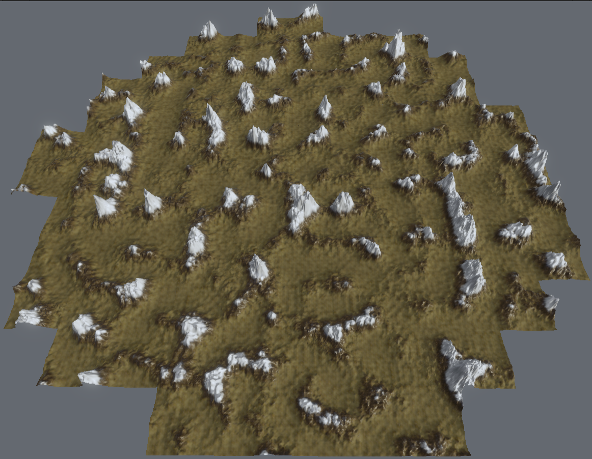
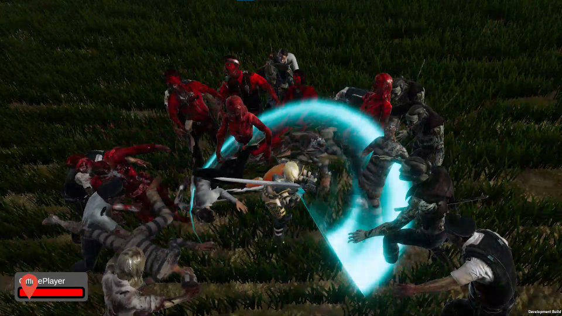
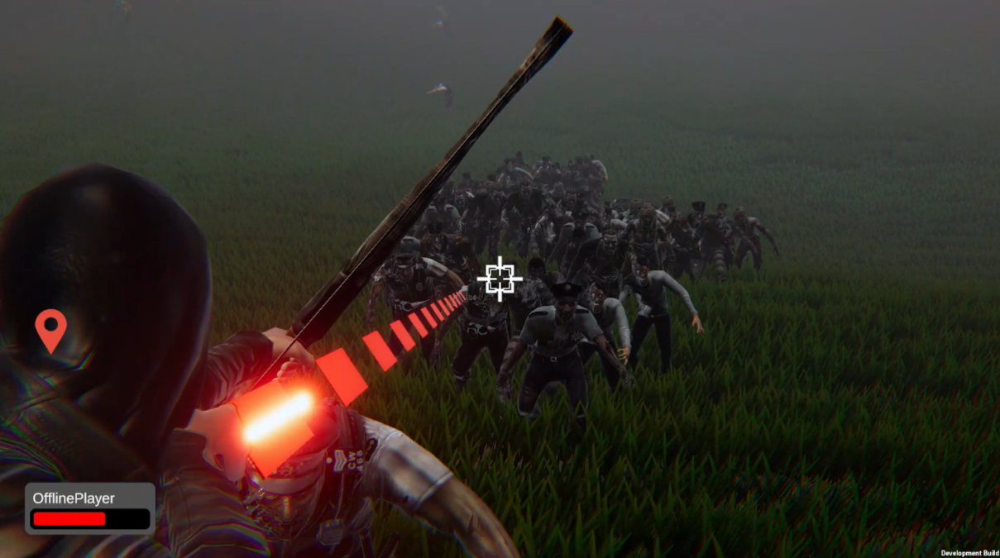

## Introduction
We were tasked with making a game from scratch using any engine we liked in 6 months.

Some of the main features in this project:
- Infinite procedural terrain generation
- 2 Player classes (Warrior and Archer) with basic levelling systems
- 2 Player Multiplayer Co-op 
- Zombie AI

## Terrain

Features: 
- Infinite terrain generation (As much as the user's memory allows)
- Uses [Compute Shaders](https://docs.unity3d.com/Manual/class-ComputeShader.html)
- Main method of generation: Layering different types 

This [article by Red Blob Games](https://www.redblobgames.com/maps/terrain-from-noise/#noise) helped a lot.

## Player Classes
### Warrior

Features:
- 2 types of attacks using sword. One of is a combination attack which the player can stop midway
- Shader graph for sword trail

### Archer

Features:
- 1 attack using the bow and arrow
- Player can load arrow, draw bow and fire. Arrow speed, damage and knockback will depend on the amount of time the player draw bow
- Animations support aiming the bow properly.

### Other Features
- Level system
    - Gives experience when the player defeats a zombie
    - The player can upgrade their stats (health, speed and attack damage) using stat points which are given when the player level ups
    - Warrior and archer has different base and max stats (Warrior has more health and is slower)
- Zombies AI
    - 8 different zombies models with slightly different speeds
    - Spawning zombie hordes
- Post-processing
    - Use various effects
- Multiplayer (Using [Photon](https://www.photonengine.com/pun))
    - Supports Singleplayer (Offline)
    - Lobby (Create and join rooms)
    - Syncing player and zombie movements, animations, terrain generation, etc
    - Spectating camera when one of the player dies
- Settings
    - Save system
    - Change settings for Gameplay, Graphics, Input and Sound
