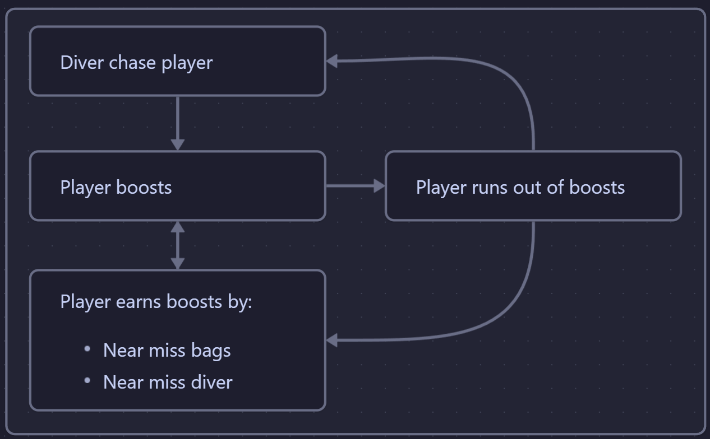

import ItchGameEmbed from "../../components/Embeds/ItchGameEmbed.astro";
import YoutubeEmbed from "../../components/Embeds/YoutubeEmbed.astro";

## Game Preview
<ItchGameEmbed itchLink="https://itch.io/embed-upload/10506970?color=333333" projectName="Test"/>

## Background
This was my submission for [Pixel Game Jam - 2024](https://itch.io/jam/-pixel-game-jam-2024). I wasn't able to work on the game for the full duration as I was still in <abbr title="National Service">NS</abbr> and had some duties. 

## Game Overview
The player escapes from a diver who's trying to catch them. There are plastic bags littered in the ocean. When the player hits a bag, they'll get slowed down. 

However, by nearly missing plastic bags, the player gains boost that they can use to escape from the diver. 

When the diver catches them, they'll lose the game. However, similar to the plastic bag, if the player nearly misses the diver, they'll gain boosts (3 times more than missing plastic bags). This has a higher risk vs reward and also gives a chance for the player to escape.

## Gameplay Loop

### Early game
The diver is slow and there are lesser bags. This gives time to the player to get used to the controls and understand the mechanics.

### Late game
Diver is faster and there are more bags, which increases tension and increases risk vs reward.

Here's how it affects how the player plays after the difficulty increase:
- **More plastic bags**: Higher chance of slowing down but at the same time, more chances to earn boosts
- **Faster diver**: Easier for the diver to catch them, but also easier for the diver to overshoot them. In the early game, they didn't really have chances on interacting with the diver. Now, it increases the chances they need to learn how to dodge the diver. See [Near miss for diver](#for-diver) for more info.

## Design decisions
The general format was inspired from [Jetpack Joyride](https://www.halfbrick.com/games/jetpack-joyride-classic). I liked the simplicity of it - just keep going right, dodge obstacles and go as far as possible.

### Near misses
When the player nearly misses a [Plastic Bag](#for-plastic-bags) or the [Diver](#for-diver), they'll get a small boost.

The inspiration came from playing [YouTube's Fullspeed Racing](https://www.youtube.com/playables/UgkxbgLQk7KP4zQKHctwKY-XKtpJ_OBWL4aO) when I was bored. The main mechanic in that game was when the player nearly misses a vehicle while driving, they earn a boost which they can use. It was surprisingly fun so I wanted to implement a near-miss mechanic in my game too.

#### For Plastic bags
- Spawns at random heights and the number of bags increases the longer the player survives. This results in a higher chance for the player to hit the bags but they have more chances of getting boosts too.
- Some bags are spawned around the same height so the player can quickly get a lot of boost.
- If they are skilled, they can keep the boost sustained for quite a long time.
- **Risk**: Slowing down 
- **Reward**: 1 boost

#### For Diver
- By nearly missing the diver, they can get 3 boost bars and speed away from the diver.
- If the diver overshoots them, they can dodge or "dance" with the diver and gain a lot of boosts.
- **Risk**: Losing the game
- **Reward**: 3 boost

Here's a video of me dodging the diver.
<YoutubeEmbed youtubeLink="https://www.youtube.com/embed/Qc6iz-6DEVM?start=260" title="The Great Tuna Escape Gameplay" />

### SFX
Added SFX in the last few minutes. Luckily, I found a [scuba diver breathing](https://pixabay.com/sound-effects/underwater-scuba-diver-28467/) and used it. He can only be heard when he's close to the player, scaring the player and warning them that the diver is close and to speed up or prepare to dodge.

## Result
--- As of time of writing, the results is still not released. ---

## Things I would like to improve
If I'm making it a real game, features I would want to add
- Upgrades like increased max boost
- Gadgets like slowing the diver down
- Different fish types with different stats and abilities

## Credits for Assets I used
It's in [itch.io page](https://gnoxnahtedev.itch.io/the-great-tuna-escape) too.
### Art
- Background: https://ansimuz.itch.io/underwater-fantasy-pixel-art-environment
- Diver: https://dkproductions.itch.io/pixel-art-diver
- Font: https://www.dafont.com/retro-gaming.font?back=bitmap

Did some simple assets myself, like the tuna, bubbles, plastic bag, and waves. I'm still learning pixel art.

### Audio
- Background: https://pixabay.com/sound-effects/indoor-nice-fish-tank-ambiance-75601/
- Diver: https://pixabay.com/sound-effects/underwater-scuba-diver-28467/